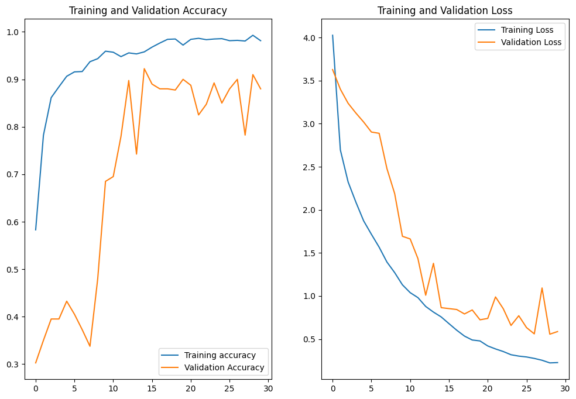
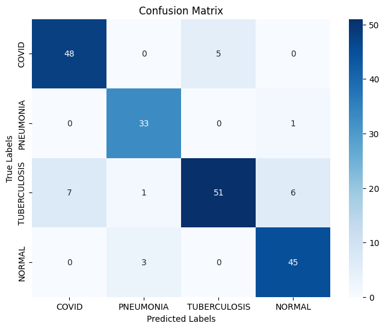

### Lung Disease Diagnosis Using Chest X-Rays

## Project Summary  
This project involved building a Convolutional Neural Network (CNN) to diagnose four lung conditions: pneumonia, tuberculosis, COVID-19, and healthy, from X-ray images. By leveraging image classification techniques, the model aims to support medical professionals in delivering accurate diagnoses, particularly in resource-limited environments. My final model was able to achieve a training accuracy of **97.64%** and a testing accuracy of **88.50%**.

---

## Problem Description  
Early and accurate diagnosis of lung diseases is critical for effective treatment and patient outcomes. However, in many regions, access to expert radiologists is limited. This project addresses the need for a reliable, automated system to analyze chest X-rays and classify lung conditions. By providing high accuracy and consistent results, this model can help streamline the diagnostic process.

---

## Techniques Used  

- **Convolutional Neural Network (CNN):** Applied to extract spatial features from X-ray images, allowing for precise classification.  
- **Normalization and Regularization:** Images were normalized to pixel values between 0 and 1. Techniques like L2 regularization and dropout were applied to minimize overfitting.  
- **Performance Metrics:** Evaluated using accuracy, confusion matrix, and visualizations of training/validation loss and accuracy.

---

## Pipeline Description  

### **Data Preparation**  
1. **Loading Data:** X-ray images from four categories were loaded using `os` and `load_img`.  
2. **Image Preprocessing:** Images were resized to 150x150 pixels and converted into arrays.  
3. **Balancing Data:** Each class was limited to 500 images to address imbalances in the dataset (This was mainly due to dataset limitations).   
4. **Normalization:** Pixel values were normalized to a range of [0, 1].  

### **Dataset Splitting**  
- Data was split into training (70%), validation (20%), and testing (10%) sets using `train_test_split`.  
- TensorFlow datasets were created for more efficient training and evaluation.  

### **Model Architecture**  
The model I ended up desigining consisted of the following: 
1. **Convolutional Layers:** Two convolutional layers with ReLU activation for feature extraction.  
2. **Batch Normalization:** Applied after convolutional layers for stable training.  
3. **Pooling Layers:** Max-pooling to reduce dimensionality and prevent overfitting.  
4. **Global Max Pooling:** Further dimensionality reduction for more efficient classification (played around with this quite a bit).  
5. **Dense Layers:** Fully connected layers with L2 regularization and dropout(had to adjust many times).  
6. **Output Layer:** Softmax activation as this is a multi-class classification problem.  

### **Training Process**  
- **Optimizer:** Adam (common practice) 
- **Loss Function:** Sparse categorical cross-entropy (useful for multiclass classification) 
- **Performance Metrics:** Accuracy  
- The model was trained with 30 epochs (didn't see much improvement with higher amounts) and batch sizes of 32 for training, validation, and test datasets.  

### **Testing**  
- Used a custom function `diagnose()` to make predictions on individual X-ray images and display the result with the corresponding class prediciton.

---

## Results and Analysis  

### Model Performance  
- **Training Accuracy:** 97.64%  
- **Testing Accuracy:** 88.50% (could've been higher, but was satisfied with this number my first iteration was ~60% as my model was rather bare)
 
 

#### Confusion Matrix  
The confusion matrix highlights the model's performance across the four classes



### Observations  
- High training accuracy indicates the model was able to learn well during training.  
- Testing accuracy demonstrates that the model was capable with new images.  
- Misclassifications observed in the confusion matrix indicate some potential for improvement. Particularly in differentiating between similar conditions like pneumonia and tuberculosis.

---

## Challenges and Future Work  

### Challenges Faced  
- **Data Imbalance:** Equalizing the dataset across classes required slicing of images (500 was the best value I found).  
- **Limited Data:** The relatively small dataset size limited the model's ability to generalize. Especially because the dataset I used only contained 576 images for covid, but over 4000 for pneumonia 
- **Class Overlap:** Pneumonia and tuberculosis have similar features, making them harder for the model to distinguish them.
- **Improve `diagnose()` function:** While passing in specific image paths works, I'm sure there are much more robust ways to handle this.

### Future Improvements  
- **Larger Dataset Size:** Incorporate additional datasets to improve generalization (I'd like to have thousands of images for each class).  
- **More Advanced Architectures:** I could trying to experiment with models like ResNet or DenseNet for better feature extraction.  
- **More Understanding:** Implementing Grad-CAM or similar techniques to visualize which areas of the X-ray influenced the model's decisions most.  
- **Deployment:** Package the model into a user-friendly application (e.g., web app or mobile app) for potential real-world usability.  

---

## How to Use  

1. **Dependencies:** Install the required packages:
   ```bash
   pip install tensorflow opencv-python numpy pandas seaborn scikit-learn matplotlib
2. **Dataset** Download the dataset as it is too large to submit.
    - The dataset can be found on Kaggle: [Lung X-Ray Dataset](https://www.kaggle.com/datasets/pritpal2873/chest-x-ray-dataset-4-categories)
